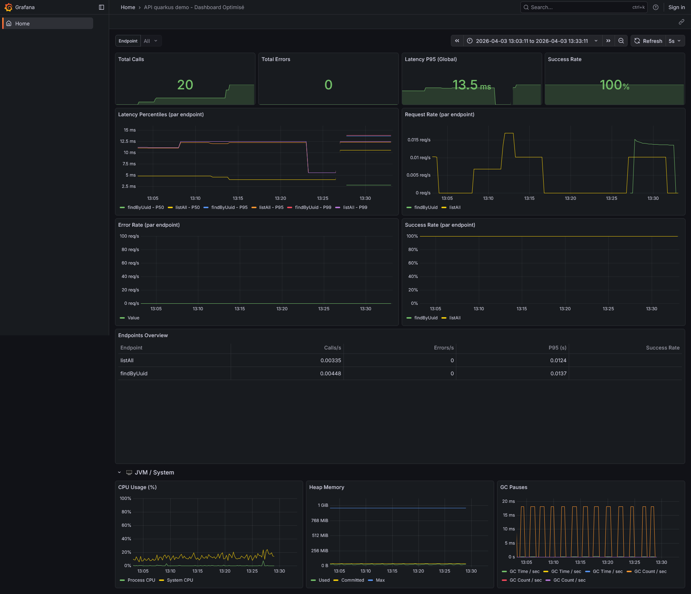

# quarkus-api-demo

Projet de démonstration illustrant l'utilisation de [quarkus-utils-communs](https://github.com/sambouch79/quarkus-utils-communs) dans une API Quarkus réelle.

## Ce que démontre ce projet

| Fonctionnalité | Classe |
|---|---|
| `@MeasuredEndpoint` — métriques Prometheus automatiques | `UserResource` |
| `PageRequest` / `PageResponse` — pagination générique | `UserPageRequest`, `UserResource` |
| Architecture hexagonale | `domain/`, `infrastructure/`, `api/` |
| `@ApiResponsesDefault` — réponses Swagger mutualisées | `UserResource` |
| `ApiKeyAuthFilter` — sécurité par clé API | `api/filter/` |
| Logging MDC structuré | `shared/logging/` |
| Dashboard Grafana prêt à l'emploi | `monitoring/` |

## Démarrage rapide

```bash
./mvnw quarkus:dev
```

L'application démarre sur `http://localhost:8080`.

## Endpoints disponibles

| Méthode | URL | Description |
|---|---|---|
| GET | `/api/v1/users` | Liste paginée |
| GET | `/api/v1/users/uuid/{uuid}` | Recherche par UUID |
| POST | `/api/v1/users` | Création |
| PATCH | `/api/v1/users/uuid/{uuid}` | Mise à jour partielle |
| DELETE | `/api/v1/users/uuid/{uuid}` | Suppression |
| GET | `/swagger-ui` | Documentation interactive |
| GET | `/q/metrics` | Métriques Prometheus |
| GET | `/q/health` | Health check |

## Authentification

Tous les endpoints (sauf `/q/*`, `/swagger-ui`, `/api/v1/ping`) requièrent le header :

```
X-API-KEY: demo-secret-key
```

## Exemples curl

```bash
# Lister les utilisateurs
curl -H "X-API-KEY: demo-secret-key" http://localhost:8080/api/v1/users

# Créer un utilisateur
curl -X POST -H "X-API-KEY: demo-secret-key" -H "Content-Type: application/json" \
  -d '{
    "nom": "Durand",
    "prenom": "Alice",
    "siret": "35600000048004",
    "numeroFiness": "123456789",
    "statutJuridique": "SARL",
    "creePar": "MON_APP"
  }' http://localhost:8080/api/v1/users
```

## Monitoring & Observabilité

### Métriques générées par `@MeasuredEndpoint`

L'annotation instrumente automatiquement chaque endpoint avec trois métriques Micrometer :

```
api_endpoint_latency_seconds{endpoint="listAll",    operation="user.list"}
api_endpoint_calls_total{endpoint="create",         operation="user.create"}
api_endpoint_errors_total{endpoint="findByUuid",    operation="user.findByUuid", exception="ResourceNotFoundException"}
```

Consultation brute :

```bash
curl http://localhost:8080/q/metrics | grep api_endpoint
```

### Dashboard Grafana

Le projet intègre un dashboard Grafana prêt à l'emploi, importable en un clic, qui visualise en temps réel les métriques générées par `@MeasuredEndpoint`.

<p align="center">
  
</p>

**Panels inclus :**

| Panel | Métrique |
|---|---|
| Latence par endpoint (histogram) | `api_endpoint_latency_seconds` |
| Appels totaux | `api_endpoint_calls_total` |
| Taux d'erreurs par exception | `api_endpoint_errors_total` |

**Import du dashboard :**

1. Ouvrir Grafana → **Dashboards → Import**
2. Charger le fichier [`monitoring/dashboard-grafana.json`](monitoring/dashboard-grafana.json)
3. Sélectionner la datasource Prometheus pointant sur `http://localhost:8080/q/metrics`

## Stack technique

- Java 21
- Quarkus 3.8
- H2 (base de données en mémoire pour la démo)
- MapStruct, Lombok
- Micrometer + Prometheus (`quarkus-micrometer-registry-prometheus`)
- quarkus-utils-commons 1.0.0